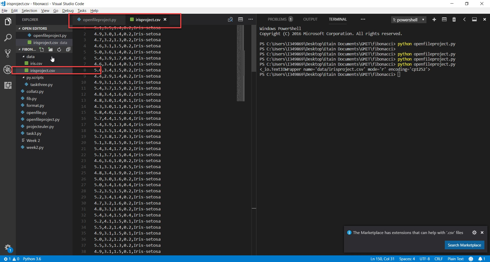
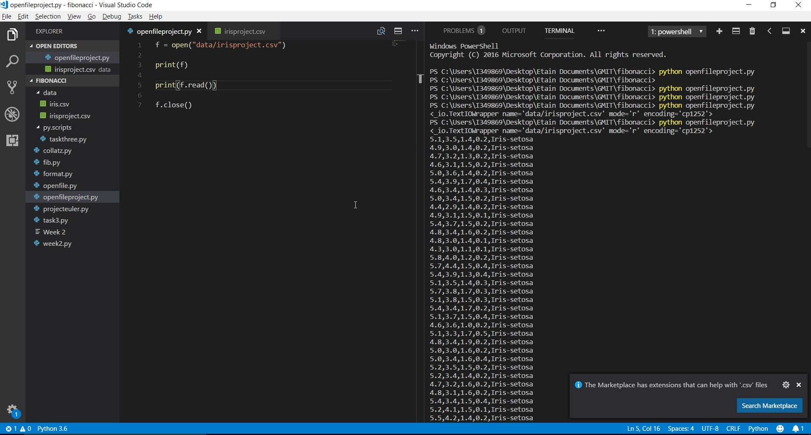
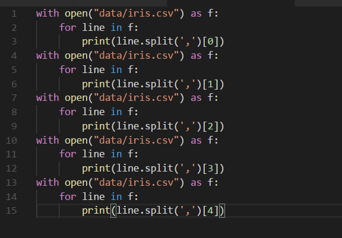
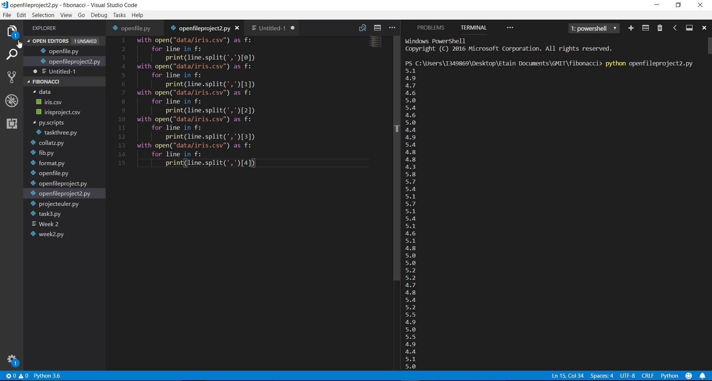
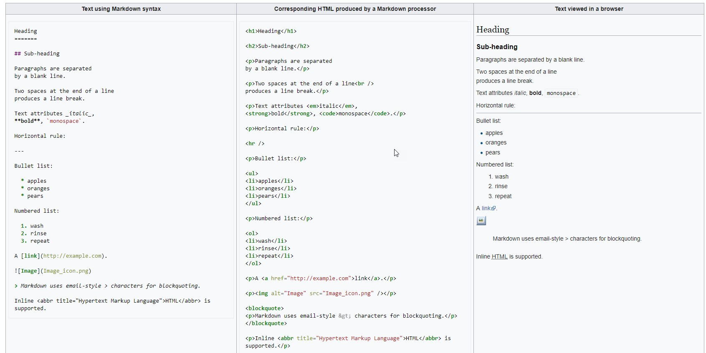

# Etain-s-Project-2018---52167---Programming-and-Scripting
Etain’s Project 2018 - 52167 - Programming and Scripting

# Research on the subject of Fisher’s Iris data set
This project is based on Fisher’s Iris data set. I intend to lay out a summary of my findings from my research on background information about this topic.
According to [Wikipedia - Iris flower data set](https://en.wikipedia.org/wiki/Iris_flower_data_set); '...the data set is composed of 50 samples from 3 species of Iris, which is a flower.' 

'Four features of the flower were measured on each sample - the length and the width of the sepals and petals, which were measured in centimetres. 
Based on the combination of these four features, Ronald Fisher (a British statistician and biologist) developed a linear discriminant model to identify and distinguish the species from each other.'

As per Wikipedia, the dataset contains a set of 150 records under 5 attributes;
1.	Petal Length, 
2.	Petal Width, 
3.	Sepal Length, 
4.	Sepal Width and 
5.	Class.

Note that the first 4 attributes were recorded as a result of the measurements in centimetres, whereas the 5th feature, ‘Class’, is a classification of the species of Iris.

According to [‘Case Study: IRIS Classification’](http://rstudio-pubs-static.s3.amazonaws.com/269829_8285925c922e445097f47925b112841f.html) ; '...the data set consists of 50 samples from each of three species of Iris (Iris setosa, Iris virginica and Iris versicolor)'. 
Note: The three different species of Iris recorded in the data set are displayed clearly in the results of code I have written. 
According to [‘Case Study: IRIS Classification’](http://rstudio-pubs-static.s3.amazonaws.com/269829_8285925c922e445097f47925b112841f.html); 'Four features were measured from each sample: the length and the width of the sepals and petals, in centimetres. The fifth column is the species of the flower observed'. 

Although familiar with what a petal was, I was unsure what exactly a sepal was, so I conducted some research into this. 'A sepal is a leaf-shaped structure found in flowering plants. It is found on the outermost part of the flower, and like a petal, a sepal is considered to be a modified leaf', ([Biology Dictionary](https://biologydictionary.net/sepal/)). 

Fisher’s Iris data set proved significant, as it became a typical test case for many statistical classification techniques in machine learning [Wikipedia - Iris flower data set](https://en.wikipedia.org/wiki/Iris_flower_data_set). 'It is a very famous and widely used dataset by everyone trying to learn machine learning and statistics', ([Case Study: IRIS Classification](http://rstudio-pubs-static.s3.amazonaws.com/269829_8285925c922e445097f47925b112841f.html)).

I was unsure what machine learning was, so I looked into this. 'Machine learning is a field of computer science which uses statistical techniques to give computer systems the ability to ‘learn’ with data, without being explicitly programmed', ([Wikipedia – Machine Learning](https://en.wikipedia.org/wiki/Machine_learning)).

Fisher’s Iris data set itself is as follows;

5.1	3.5	1.4	0.2	Iris-setosa

4.9	3	1.4	0.2	Iris-setosa

4.7	3.2	1.3	0.2	Iris-setosa

4.6	3.1	1.5	0.2	Iris-setosa

5	3.6	1.4	0.2	Iris-setosa

5.4	3.9	1.7	0.4	Iris-setosa

4.6	3.4	1.4	0.3	Iris-setosa

5	3.4	1.5	0.2	Iris-setosa

4.4	2.9	1.4	0.2	Iris-setosa

4.9	3.1	1.5	0.1	Iris-setosa

5.4	3.7	1.5	0.2	Iris-setosa

4.8	3.4	1.6	0.2	Iris-setosa

4.8	3	1.4	0.1	Iris-setosa

4.3	3	1.1	0.1	Iris-setosa

5.8	4	1.2	0.2	Iris-setosa

5.7	4.4	1.5	0.4	Iris-setosa

5.4	3.9	1.3	0.4	Iris-setosa

5.1	3.5	1.4	0.3	Iris-setosa

5.7	3.8	1.7	0.3	Iris-setosa

5.1	3.8	1.5	0.3	Iris-setosa

5.4	3.4	1.7	0.2	Iris-setosa

5.1	3.7	1.5	0.4	Iris-setosa

4.6	3.6	1	0.2	Iris-setosa

5.1	3.3	1.7	0.5	Iris-setosa

4.8	3.4	1.9	0.2	Iris-setosa

5	3	1.6	0.2	Iris-setosa

5	3.4	1.6	0.4	Iris-setosa

5.2	3.5	1.5	0.2	Iris-setosa

5.2	3.4	1.4	0.2	Iris-setosa

4.7	3.2	1.6	0.2	Iris-setosa

4.8	3.1	1.6	0.2	Iris-setosa

5.4	3.4	1.5	0.4	Iris-setosa

5.2	4.1	1.5	0.1	Iris-setosa

5.5	4.2	1.4	0.2	Iris-setosa

4.9	3.1	1.5	0.1	Iris-setosa

5	3.2	1.2	0.2	Iris-setosa

5.5	3.5	1.3	0.2	Iris-setosa

4.9	3.1	1.5	0.1	Iris-setosa

4.4	3	1.3	0.2	Iris-setosa

5.1	3.4	1.5	0.2	Iris-setosa

5	3.5	1.3	0.3	Iris-setosa

4.5	2.3	1.3	0.3	Iris-setosa

4.4	3.2	1.3	0.2	Iris-setosa

5	3.5	1.6	0.6	Iris-setosa

5.1	3.8	1.9	0.4	Iris-setosa

4.8	3	1.4	0.3	Iris-setosa

5.1	3.8	1.6	0.2	Iris-setosa

4.6	3.2	1.4	0.2	Iris-setosa

5.3	3.7	1.5	0.2	Iris-setosa

5	3.3	1.4	0.2	Iris-setosa

7	3.2	4.7	1.4	Iris-versicolor

6.4	3.2	4.5	1.5	Iris-versicolor

6.9	3.1	4.9	1.5	Iris-versicolor

5.5	2.3	4	1.3	Iris-versicolor

6.5	2.8	4.6	1.5	Iris-versicolor

5.7	2.8	4.5	1.3	Iris-versicolor

6.3	3.3	4.7	1.6	Iris-versicolor

4.9	2.4	3.3	1	Iris-versicolor

6.6	2.9	4.6	1.3	Iris-versicolor

5.2	2.7	3.9	1.4	Iris-versicolor

5	2	3.5	1	Iris-versicolor

5.9	3	4.2	1.5	Iris-versicolor

6	2.2	4	1	Iris-versicolor

6.1	2.9	4.7	1.4	Iris-versicolor

5.6	2.9	3.6	1.3	Iris-versicolor

6.7	3.1	4.4	1.4	Iris-versicolor

5.6	3	4.5	1.5	Iris-versicolor

5.8	2.7	4.1	1	Iris-versicolor

6.2	2.2	4.5	1.5	Iris-versicolor

5.6	2.5	3.9	1.1	Iris-versicolor

5.9	3.2	4.8	1.8	Iris-versicolor

6.1	2.8	4	1.3	Iris-versicolor

6.3	2.5	4.9	1.5	Iris-versicolor

6.1	2.8	4.7	1.2	Iris-versicolor

6.4	2.9	4.3	1.3	Iris-versicolor

6.6	3	4.4	1.4	Iris-versicolor

6.8	2.8	4.8	1.4	Iris-versicolor

6.7	3	5	1.7	Iris-versicolor

6	2.9	4.5	1.5	Iris-versicolor

5.7	2.6	3.5	1	Iris-versicolor

5.5	2.4	3.8	1.1	Iris-versicolor

5.5	2.4	3.7	1	Iris-versicolor

5.8	2.7	3.9	1.2	Iris-versicolor

6	2.7	5.1	1.6	Iris-versicolor

5.4	3	4.5	1.5	Iris-versicolor

6	3.4	4.5	1.6	Iris-versicolor

6.7	3.1	4.7	1.5	Iris-versicolor

6.3	2.3	4.4	1.3	Iris-versicolor

5.6	3	4.1	1.3	Iris-versicolor

5.5	2.5	4	1.3	Iris-versicolor

5.5	2.6	4.4	1.2	Iris-versicolor

6.1	3	4.6	1.4	Iris-versicolor

5.8	2.6	4	1.2	Iris-versicolor

5	2.3	3.3	1	Iris-versicolor

5.6	2.7	4.2	1.3	Iris-versicolor

5.7	3	4.2	1.2	Iris-versicolor

5.7	2.9	4.2	1.3	Iris-versicolor

6.2	2.9	4.3	1.3	Iris-versicolor

5.1	2.5	3	1.1	Iris-versicolor

5.7	2.8	4.1	1.3	Iris-versicolor

6.3	3.3	6	2.5	Iris-virginica

5.8	2.7	5.1	1.9	Iris-virginica

7.1	3	5.9	2.1	Iris-virginica

6.3	2.9	5.6	1.8	Iris-virginica

6.5	3	5.8	2.2	Iris-virginica

7.6	3	6.6	2.1	Iris-virginica

4.9	2.5	4.5	1.7	Iris-virginica

7.3	2.9	6.3	1.8	Iris-virginica

6.7	2.5	5.8	1.8	Iris-virginica

7.2	3.6	6.1	2.5	Iris-virginica

6.5	3.2	5.1	2	Iris-virginica

6.4	2.7	5.3	1.9	Iris-virginica

6.8	3	5.5	2.1	Iris-virginica

5.7	2.5	5	2	Iris-virginica

5.8	2.8	5.1	2.4	Iris-virginica

6.4	3.2	5.3	2.3	Iris-virginica

6.5	3	5.5	1.8	Iris-virginica

7.7	3.8	6.7	2.2	Iris-virginica

7.7	2.6	6.9	2.3	Iris-virginica

6	2.2	5	1.5	Iris-virginica

6.9	3.2	5.7	2.3	Iris-virginica

5.6	2.8	4.9	2	Iris-virginica

7.7	2.8	6.7	2	Iris-virginica

6.3	2.7	4.9	1.8	Iris-virginica

6.7	3.3	5.7	2.1	Iris-virginica

7.2	3.2	6	1.8	Iris-virginica

6.2	2.8	4.8	1.8	Iris-virginica

6.1	3	4.9	1.8	Iris-virginica

6.4	2.8	5.6	2.1	Iris-virginica

7.2	3	5.8	1.6	Iris-virginica

7.4	2.8	6.1	1.9	Iris-virginica

7.9	3.8	6.4	2	Iris-virginica

6.4	2.8	5.6	2.2	Iris-virginica

6.3	2.8	5.1	1.5	Iris-virginica

6.1	2.6	5.6	1.4	Iris-virginica

7.7	3	6.1	2.3	Iris-virginica

6.3	3.4	5.6	2.4	Iris-virginica

6.4	3.1	5.5	1.8	Iris-virginica

6	3	4.8	1.8	Iris-virginica

6.9	3.1	5.4	2.1	Iris-virginica

6.7	3.1	5.6	2.4	Iris-virginica

6.9	3.1	5.1	2.3	Iris-virginica

5.8	2.7	5.1	1.9	Iris-virginica

6.8	3.2	5.9	2.3	Iris-virginica

6.7	3.3	5.7	2.5	Iris-virginica

6.7	3	5.2	2.3	Iris-virginica

6.3	2.5	5	1.9	Iris-virginica

6.5	3	5.2	2	Iris-virginica

6.2	3.4	5.4	2.3	Iris-virginica

5.9	3	5.1	1.8	Iris-virginica

We can see from the data set that the results are not numbered – it would be very difficult for the viewer to glance at the above information and know that there are in fact 150 records here, or that 50 of these records relate to Iris-setosa, 50 relate to Iris-versicolor and 50 relate to Iris-virginica. [Python]( https://www.python.org/) is an excellent tool for eradicating this issue. I will demonstrate this throughout this document.
I found that the ‘Project 2018 overview’ video supplied on Moodle by Dr Ian McLoughlin gave me some good ideas and a starting point for this project.
It was my intention to assess the results recorded in the data set in [Python](https://www.python.org/), and then investigate how to display this information, specifically the information which relates to the fifth attribute – Class - in a more visually appealing way to an audience.  

I researched how to correctly upload information to a README, as I needed to submit my research and findings in text format. I realised while watching the ‘READMEs’ video supplied by Dr Ian McLoughlin on Moodle, that I had forgotten to include a gitignore in my repository for this project. However, I had already submitted the Project URL via Moodle, so I could not amend this. Furthermore, I realised while researching READMEs for this project that I had incorrectly submitted my previous repositories while completing the weekly exercises – an example of this was inserting a Microsoft Word Document for one README, instead of following the correct procedure which is to insert the information to the README in text format. I took this as a learning experience, and tried to demonstrate that I now understand how to correctly submit information to repositories in GitHub READMEs while completing this project.

While researching READMEs I wondered how I would correctly upload an image (e.g. a chart) to GitHub. I learned this from [Mastering Markdown](https://guides.github.com/features/mastering-markdown/) and have included some images in this README. I will delve into the initial challenges I faced while trying to successfully complete this;
I knew how to upload pictures to a README in GitHub from [Mastering Markdown](https://guides.github.com/features/mastering-markdown/). The below image is supplied on [Mastering Markdown](https://guides.github.com/features/mastering-markdown/) and I employed this technique to initially upload images from the web to README;

However, I was unsure how to correctly upload screenshots from my own machine to show the work I had completed in Visual Studio Code. I remembered covering this in the ‘READMEs’ video on Moodle, so I referred back to this for guidance. I learned that you must follow the same formula as shown in the above image in terms of the exclamation point at the beginning of where you wish to insert an image, square brackets containing a description of what the image represents, and regular brackets with the name of the image from the web, however you insert the name of the image which you have saved in your GitHub repository from your own machine inside the regular brackets brackets. I initially tried to complete this with a PNG file, but when this did not work I saved the image on my desktop again as a JPG file and was able to upload it to the repository and successfully upload it to the README. I also realised through trial and error that there can be no spaces in the name of the image.

I also learned that it is possible to hyperlink [Python]( https://www.python.org/).

When I download Fischer’s Iris Data Set from http://archive.ics.uci.edu/ml/datasets/Iris originally, the data set looked like this (please note this is a snippet of the result, as the entire result is substantially large);

We can see from this snippet that there is no clear separation between each measurement, merely a comma between each of the different measurements. This is not visually appealing to an audience – it is difficult for the human eye to distinguish each individual measurement as they are so closely bunched together. When the code I have written in [Python]( https://www.python.org/) is run, the various measurements are separated based on which of the 5 attributes they represent (i.e. Petal Length, Petal Width, Sepal Length, Sepal Width or Class), as opposed to being separated by commas alone. This makes the separation of each individual measurement clearer and easier to read and absorb for the viewer. This is visible in my below screenshot.

## Steps I took to generate the result: 
I created a new file in my ‘Data’ folder in Visual Studio Code named ‘irisproject.csv’. I pasted Fisher’s Iris data set (which I obtained from [UCI Machine Learning Repository – Iris Data Set – Data Folder](http://archive.ics.uci.edu/ml/datasets/Iris) in here from the browser, and saved.

It took me a few attempts to figure out how to proceed (hence the initial attempt ‘openfileproject.py shown in the below 2 screenshots), and I re-watched the ‘Formatting Output’ video from Moodle several times for guidance.

I combined the processes I learned from this video with the processes I learned from the ‘Splitting Strings’ video, and this was the basis for my code. I figured that if I combined the ‘curly braces’ method from the ‘Formatting Output’ video WITHOUT the curly braces, with the ‘with open("data/iris.csv") as f:’ method which I took from the ‘Splitting strings’ video, I could obtain the result I was searching for. It took me some time to play around with the code but eventually I settled on the code which gave me the result I wanted. I composed the following code;

with open("data/iris.csv") as f:

    
    for line in f:
        
        print(line.split(',')[0])

with open("data/iris.csv") as f:
    
    for line in f:
        
        print(line.split(',')[1])

with open("data/iris.csv") as f:
    
    for line in f:
        
        print(line.split(',')[2])

with open("data/iris.csv") as f:
    
    for line in f:
        
        print(line.split(',')[3])

with open("data/iris.csv") as f:
    
    for line in f:
        
        print(line.split(',')[4])

Screenshot of my code in Visual Studio Code;

When I ran the code in the above screenshot this divided the 5 columns where the comma was positioned (i.e. divided each measurement of each attribute) and printed each measurement in it’s own individual column.

## Result:

This makes the 5 attributes clearer to the viewer.

In order to run the [Python]( https://www.python.org/) code I have written in [Visual Studio Code]( https://code.visualstudio.com/), you must click on 'View' > 'Integrated Terminal';

Select ‘1 powershell’ and type: 'python openfileproject2.py', then hit return on the keyboard.

While observing the result I noticed that the final attribute (Class) had been grouped in Python as follows;
All of the ‘Iris-setosa’ were grouped together first, then all the ‘Iris-versicolor’ were grouped together secondly, and all ‘Iris-virginica’ were grouped together finally. They were not mixed together. This gave the results printed to the terminal a nicely organized effect. 
I then decided to copy and paste the result printed to the terminal to a notepad on my desktop. I have included this notepad in this repository.
When I tried to complete this initially using the mouse I was unsuccessful. I then pressed ‘Ctrl’ and ‘A’ on the keyboard, and achieved my goal as the system allowed me to copy using the mouse after doing this. This reminded me of one of the early videos posted to Moodle in which Dr Ian McLoughlin advised us that keyboard commands are easier and faster to use while dealing with Python and Visual Studio Code than the mouse. I pasted the copied data to the Notepad.
I then decided to copy and paste everything from the notepad into Visual Studio Code to see what numbers would appear beside each piece of data. I created a new file (File > new File), and pasted the data into it.
I noticed that all of the numerical values had transferred to VS Code in the way I’d anticipated them to, i.e. they were all in line one after the other with no spaces in between them, meaning the numerical order beside them was correct, and I could use this to tell me how many measurements in total had been recorded.

We can see from this that there were 600 values in centimetres measured and recorded.
These 600 values are made up in equal part of the first 4 attributes; Petal Length, Petal Width, Sepal Length, Sepal Width.
The result I had not anticipated was the way the fifth attribute appeared after I had pasted the data from notepad into VS Code – there was a space between each value of the ‘Class’. This was the only attribute not recorded in numerical value, but by letters.
I was unsure why this had happened, but then I noticed that this was the format in which the result was printed to the terminal when I ran my code. 
I was able to delete these additional spaces by placing the cursor on the space and hitting the backspace key on the keyboard. Having completed this for all the unwanted spaces VS Code showed that there were 750 records in total, as expected.

I noticed that ‘Iris-setosa’ ran from 601 to 650.
‘Iris-versicolor’ ran from 651 to 700, and ‘Iris-virginica’ ran from 701 to 750.
It’s clear to see from this that there are 3 classes of Iris recorded in Fisher’s Iris data set – i.e. 3 species of iris.
We can also establish that there are 50 Iris-setosa, 50 Iris-versicolor and 50 Iris-virginica.
The first attribute (petal length) is displayed in a column by itself. We can copy and paste this result from the terminal into a ‘New File’ in Visual Studio Code. We know that the attributes were measured for 50 plants, so the top 50 results are the petal length measurements. From merely glancing at this column we can get an idea as to what the general measurements are in centimetres for each attribute. This would be a useful technique to employ from a Data Analytics perspective for an audience to quickly estimate the average results in a data set. In this example, we can see clearly from Python that the petal length measurements are mainly within a 4cm – 5.8cm range, with the largest recorded measurement for a petal length being 5.8cm.

Based on the results of my Python code, I used PowerPoint to compose the below graph. This may be more digestible and visually appealing to an audience who is unfamiliar with Python, and I personally think it simplifies the information. It displays the 3 different ‘Classes’, or species of Iris, which were subject to the investigation that resulted in Fisher’s Iris Data Set. It was very easy to use the results generated by Python regarding ‘Class’ to compose this graph.

## Visual Studio Code and Python
I always used [Visual Studio Code]( https://code.visualstudio.com/) to run [Python]( https://www.python.org/) while completing this module. Prior to commencing this module I had never heard of Visual Studio Code, so I conducted some research on it. According to [Wikipedia]( https://en.wikipedia.org/wiki/Visual_Studio_Code); Visual Studio Code is a source code editor developed by Microsoft for Windows, Linux and macOS. It includes support for debugging, embedded Git control, syntax highlighting, intelligent code completion, snippets, and code refactoring. It is also customizable, so users can change the editor's theme, keyboard shortcuts, and preferences. It is free and open-source, although the official download is under a proprietary license.
I wondered what a ‘source code editor’ was, which I also researched on [Wikipedia]( https://en.wikipedia.org/wiki/Source_code_editor); A source code editor is a text editor program designed specifically for editing source code of computer programs by programmers. It may be a standalone application or it may be built into an integrated development environment (IDE) or web browser. Source code editors are the most fundamental programming tool, as the fundamental job of programmers is to write and edit source code.

## Conclusion:
We can see from the above example how Data Analytics can be useful in establishing the value of the information collected in data sets, and how [Python](https://www.python.org/) is a good tool for this purpose.
My code was rated 10/10 as shown in the below screenshot, which I was very pleased with!
[Python](https://www.python.org/) can be used to represent Fisher’s Iris data set in a more visually appealing way to an audience, and ensures the receiver of the information can absorb it in a quicker and more digestible fashion than they would if they had nothing to observe other than the raw, unedited data set.

# List of References;
*	Wikipedia - (https://en.wikipedia.org/wiki/Iris_flower_data_set)
*	Biology Dictionary (https://biologydictionary.net/sepal/)
*   Case Study: IRIS Classification (http://rstudio-pubs-static.s3.amazonaws.com/269829_8285925c922e445097f47925b112841f.html)
*	UC Irvine Machine Learning Repository. Iris data set. (http://archive.ics.uci.edu/ml/datasets/Iris)
*   Wikipedia README page (https://en.wikipedia.org/wiki/README)
*	Markdown Cheatsheet (https://github.com/adam-p/markdown-here/wiki/Markdown-Cheatsheet)
*	Markdown Wikipedia (https://en.wikipedia.org/wiki/Markdown)
*	Mastering Markdown (https://guides.github.com/features/mastering-markdown/)
*	Python Website (https://www.python.org/)
*	The Old Farmer’s Almanac https://www.almanac.com/plant/irises
*	The Python Tutorial https://docs.python.org/3/tutorial/
*   Visual Studio Code https://code.visualstudio.com/

### Etain’s Project 2018 -52167 - Programming and Scripting - Brainstorming Notes/ Rough Plans
https://github.com/EtainUpton/Etain-s-Project-2018---52167---Programming-and-Scripting

Write a summary of my findings in the form of README.
Include tables/graphics
Include a pic of Fischer
Include : I assessed the results in Python and then investigated how to display this information in a more visually appealing way to an audience. 
I watched the ‘Project 2018 overview’ video supplied on Moodle by Dr Ian McLoughlin which gave me some good pointers and a starting point for this project.
The project should contain a GitHub repository with a README.md file and a Python script.
The README should contain a summary of the dataset and your investigations into it. It should also clearly document how to run the Python code you used to investigate the data set, and what that code does. Furthermore, it should list all references used in completing the project.
Create the new repository & submit the link ASAP. (Completed)

25% Research Investigation of problem and possible solutions. 

25% Development Clear analysis and well-written supporting code. 

25% Consistency Good planning and pragmatic attitude to work. 

25% Documentation Detailed descriptions and explanations.

Watch the README file video. – don’t upload a word document, upload a text file to the readme.
I researched how to correctly upload information to a README as I want to submit my research and findings in text format.
 
I realised while watching the ‘READMEs’ video supplied by Dr Ian McLoughlin on Moodle that I had forgotten to include a gitignore in my repository for this project. However, I had already submitted the Project URL via Moodle, so I could not amend this.
I realised while researching READMEs for this project that I had incorrectly submitted my previous repositories while completing the weekly exercises – I know for one README I inserted a Microsoft Word Document.

Having completed the weekly tasks for this module, I learned that I needed to make regular commits to GitHub for this project, in order to display the gradual and continuous work I am undertaking as I complete it.

I need to add comments to all of my source code saying how it works and how I figured it out.

Issues from my weekly tasks which I have tried to rectify for this project:

*  None of the Python files had the ".py" extension. 

*  I needed a much better README file, with reference to any sources I used.

I researched how to correctly upload information to a README as I want to submit my research and findings in text format.

